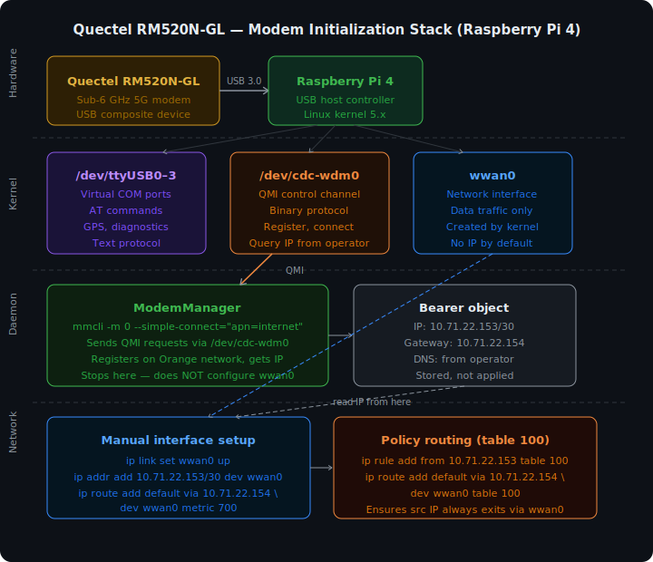

# Quectel RM520N-GL on Raspberry Pi 4 — Full Setup Guide

**Hardware**: Raspberry Pi 4
**Modem**: Quectel RM520N-GL (5G, USB)
**SIM**: Orange Poland (MCC/MNC 260-03)
**OS**: Debian GNU/Linux 13 (Trixie), kernel 6.12.x
**Protocol**: QMI (`cdc-wdm0`) → network interface `wwan0`

> **USB port requirement**: Connect the modem to a **USB 3.0 (blue) port** on the Raspberry Pi. USB 2.0 causes intermittent USB resets (`EPROTO -71`) under upload load due to shared half-duplex bus between bulk and interrupt endpoints. See [section 10](#10-troubleshooting) for details.



---

## 1. Install packages

```bash
sudo apt update
sudo apt install -y modemmanager libqmi-utils libmbim-utils minicom
```

| Package       | Tested version | Purpose                               |
| ------------- | -------------- | ------------------------------------- |
| modemmanager  | 1.24.0         | D-Bus daemon for modem management     |
| libqmi-utils  | 1.36.0         | `qmicli` tool for direct QMI access   |
| libmbim-utils | 1.32.0         | `mbimcli` tool (not used, but useful) |
| minicom       | 2.10           | Serial terminal for AT commands       |

### Enable and start ModemManager

```bash
sudo systemctl enable ModemManager
sudo systemctl start ModemManager
```

---

## 2. Device ports

After connecting the modem, the following devices are created:

| Device          | Type      | Purpose                               |
| --------------- | --------- | ------------------------------------- |
| `/dev/ttyUSB0`  | QCDM/DIAG | Diagnostics (ignored by ModemManager) |
| `/dev/ttyUSB1`  | GPS       | GPS data                              |
| `/dev/ttyUSB2`  | AT        | AT commands (primary port)            |
| `/dev/ttyUSB3`  | AT        | AT commands (secondary port)          |
| `/dev/cdc-wdm0` | QMI       | QMI protocol (used by ModemManager)   |
| `wwan0`         | NET       | Linux network interface for traffic   |

Verify the USB device is detected:

```bash
lsusb | grep Quectel
# 2c7c:0801 — VID:PID for RM520N-GL

ls /dev/ttyUSB* /dev/cdc-wdm0
```

---

## 3. Kernel modules

Required modules load automatically:

```bash
lsmod | grep -E "qmi|option|usb_wwan|cdc_wdm"
```

Expected output:

```
qmi_wwan    (for cdc-wdm0 and wwan0)
option      (for ttyUSB ports)
usb_wwan
cdc_wdm
```

If modules are not loaded:

```bash
sudo modprobe qmi_wwan
sudo modprobe option
```

---

## 4. AT commands — diagnostics

Connect to the AT port via minicom:

```bash
sudo minicom -D /dev/ttyUSB2 -b 115200
```

Or via screen:

```bash
sudo screen /dev/ttyUSB2 115200
```

### Basic AT commands

```
AT                          # Check communication → OK
ATI                         # Modem info (manufacturer, model, firmware)
AT+CIMI                     # SIM IMSI
AT+CCID                     # SIM ICCID
AT+CPIN?                    # PIN status (+CPIN: READY means no PIN required)
AT+CREG?                    # Network registration (0,1 = registered home)
AT+CEREG?                   # LTE/5G registration status
AT+COPS?                    # Current operator (26003 = Orange PL)
AT+CSQ                      # Signal strength (rssi,ber)
AT+QNWINFO                  # Current network technology (LTE/NR5G and band)
AT+QENG="servingcell"       # Detailed serving cell info
```

### APN and PDP context commands

```
AT+CGDCONT?                 # List PDP contexts
AT+CGDCONT=1,"IP","internet" # Set APN for context 1 (Orange Poland)
AT+CGACT?                   # Context activation status (1 = active)
```

### Quectel internal IP stack (diagnostics only — does NOT route traffic through wwan0)

```
AT+QIACT=5                  # Activate context 5 in Quectel internal IP stack
AT+QIACT?                   # Check assigned IP address
AT+QPING=5,"8.8.8.8"        # Ping via Quectel internal stack (not through wwan0)
AT+QIDEACT=5                # Deactivate context 5
```

> **Important**: `AT+QIACT` activates the **modem's internal IP stack**. It is useful for verifying network connectivity, but traffic through `wwan0` (Linux network stack) will **not work** this way. For real traffic, QMI via ModemManager is required (see section 6).

### Check USB mode

```
AT+QCFG="usbnet"            # Must be 0 (QMI/RMNET mode)
                             # If not 0: AT+QCFG="usbnet",0 → reboot modem
```

---

## 5. Check status via ModemManager

```bash
# List modems
mmcli -L

# Full modem status (index can be 0, 1, 2 — increments on each reprobe)
mmcli -m 0

# Key fields to look for:
#   state: registered         — SIM registered, ready to connect
#   operator name: Orange PL
#   operator id: 26003        — MCC/MNC Orange Poland
#   packet service state: attached
```

### Expected state before connecting

```
state: registered
3GPP registration: home
packet service state: attached
```

---

## 6. Connect via ModemManager (QMI → wwan0)

> **Critical**: Do not run `qmicli` directly against `/dev/cdc-wdm0` while ModemManager is running — it will break the QMI connection and force a reprobe. To use `qmicli` directly, stop MM first: `sudo systemctl stop ModemManager`.

```bash
# Get current modem index
MODEM=$(mmcli -L | grep -oP 'Modem/\K[0-9]+')

# Connect with Orange Poland APN
sudo mmcli -m $MODEM --simple-connect="apn=internet,ip-type=ipv4"

# Expected output:
# successfully connected the modem at bearer /org/freedesktop/ModemManager1/Bearer/N
```

### Get IP settings from bearer

```bash
# Find bearer index (type "default", not "default-attach")
mmcli -m $MODEM | grep bearer

# Inspect bearer
BEARER=$(mmcli -m $MODEM | grep -oP 'Bearer/\K[0-9]+' | tail -1)
mmcli -b $BEARER
```

Example bearer output:

```
IPv4 configuration | method: static
                   | address: 10.71.103.240
                   |  prefix: 27
                   | gateway: 10.71.103.241
                   |     dns: 194.204.159.1, 194.204.152.34
                   |     mtu: 1500
```

---

## 7. Configure wwan0 interface

```bash
# Values from bearer (example)
IP_ADDR="10.71.103.240"
IP_PREFIX="27"
GW="10.71.103.241"

# Bring up the interface
sudo ip link set wwan0 up

# Assign IP
sudo ip addr flush dev wwan0
sudo ip addr add "${IP_ADDR}/${IP_PREFIX}" dev wwan0

# Default route via modem — metric 700 keeps WiFi/Ethernet (metric ~600) as primary
sudo ip route add default via "$GW" dev wwan0 metric 700

# Policy routing — REQUIRED if WiFi/Ethernet is also active
# Without this, sockets bound to wwan0 IP route data via WiFi,
# carrier can't reverse-NAT ACKs back → TCP upload stalls within ~1 second.
sudo ip rule add from "$IP_ADDR" table 100
sudo ip route add default via "$GW" dev wwan0 table 100

# Verify
ip addr show wwan0
ip route show
ip rule show | grep "$IP_ADDR"
```

### Test traffic

```bash
ping -I wwan0 -c 4 8.8.8.8
# Expected: 0% packet loss, rtt ~15-50ms

curl --interface wwan0 https://ipinfo.io/ip
# Should return an Orange Poland IP address
```

---

## 8. Auto-connect on boot

### Script `/home/notel/quectel-connect.sh`

```bash
#!/bin/bash
set -e

MODEM_INDEX=""
MAX_WAIT=60
WAITED=0

echo "[quectel] Waiting for modem..."
while [ -z "$MODEM_INDEX" ]; do
    MODEM_PATH=$(mmcli -L 2>/dev/null | grep -oP '/org/freedesktop/ModemManager1/Modem/\K[0-9]+' | head -1)
    if [ -n "$MODEM_PATH" ]; then
        MODEM_INDEX="$MODEM_PATH"
        break
    fi
    sleep 2
    WAITED=$((WAITED + 2))
    [ $WAITED -ge $MAX_WAIT ] && echo "[quectel] ERROR: modem not found" && exit 1
done

echo "[quectel] Found modem index: $MODEM_INDEX"

WAITED=0
while true; do
    STATE=$(mmcli -m "$MODEM_INDEX" 2>/dev/null | grep -oP '(?<=state: )[\w]+')
    [ "$STATE" = "registered" ] || [ "$STATE" = "connected" ] && break
    sleep 2
    WAITED=$((WAITED + 2))
    [ $WAITED -ge $MAX_WAIT ] && echo "[quectel] ERROR: not registered (state: $STATE)" && exit 1
done

if [ "$STATE" != "connected" ]; then
    mmcli -m "$MODEM_INDEX" --simple-connect="apn=internet,ip-type=ipv4"
fi

BEARER_INDEX=$(mmcli -m "$MODEM_INDEX" 2>/dev/null | grep -oP '/org/freedesktop/ModemManager1/Bearer/\K[0-9]+' | tail -1)

IP_ADDR=$(mmcli -b "$BEARER_INDEX" 2>/dev/null | grep -oP '(?<=address: )[\d.]+')
IP_PREFIX=$(mmcli -b "$BEARER_INDEX" 2>/dev/null | grep -oP '(?<=prefix: )[\d]+')
GW=$(mmcli -b "$BEARER_INDEX" 2>/dev/null | grep -oP '(?<=gateway: )[\d.]+')
DNS1=$(mmcli -b "$BEARER_INDEX" 2>/dev/null | grep -oP '(?<=dns: )[\d.]+' | head -1)
DNS2=$(mmcli -b "$BEARER_INDEX" 2>/dev/null | grep -oP '(?<=dns: )[\d.]+' | tail -1)

ip link set wwan0 up
ip addr flush dev wwan0
ip addr add "${IP_ADDR}/${IP_PREFIX}" dev wwan0
ip route add default via "$GW" dev wwan0 metric 700 2>/dev/null || true

# Policy routing: traffic from wwan0 IP always exits via wwan0
ip rule del from "${IP_ADDR}" table 100 2>/dev/null || true
ip rule add from "${IP_ADDR}" table 100
ip route flush table 100 2>/dev/null || true
ip route add default via "$GW" dev wwan0 table 100

echo "nameserver $DNS1" > /etc/resolv.conf.wwan0
[ -n "$DNS2" ] && echo "nameserver $DNS2" >> /etc/resolv.conf.wwan0

echo "[quectel] wwan0 up: ${IP_ADDR}/${IP_PREFIX} via ${GW}"
```

```bash
chmod +x /home/notel/quectel-connect.sh
```

### Systemd service `/etc/systemd/system/quectel-connect.service`

```ini
[Unit]
Description=Quectel RM520N-GL modem connect
After=ModemManager.service network.target
Wants=ModemManager.service

[Service]
Type=oneshot
RemainAfterExit=yes
ExecStart=/home/notel/quectel-connect.sh
Restart=on-failure
RestartSec=10

[Install]
WantedBy=multi-user.target
```

```bash
sudo systemctl daemon-reload
sudo systemctl enable quectel-connect.service
sudo systemctl start quectel-connect.service

# Check status
sudo systemctl status quectel-connect.service
```

---

## 9. DNS configuration

By default the script does not modify `/etc/resolv.conf` (to avoid breaking WiFi/Ethernet DNS). Orange Poland DNS servers are saved to `/etc/resolv.conf.wwan0`.

To use modem DNS globally:

```bash
sudo cp /etc/resolv.conf.wwan0 /etc/resolv.conf
```

Or via systemd-resolved:

```bash
sudo resolvectl dns wwan0 194.204.159.1 194.204.152.34
sudo resolvectl domain wwan0 "~."
```

---

## 10. Troubleshooting

### Modem not detected (`mmcli -L` returns nothing)

```bash
lsusb | grep 2c7c          # Check USB
dmesg | tail -20           # Check kernel messages
sudo systemctl restart ModemManager
```

### `mmcli --simple-connect` fails

Common errors and fixes:

| Error                        | Cause                                 | Fix                                   |
| ---------------------------- | ------------------------------------- | ------------------------------------- |
| `pdn-ipv4-call-throttled`    | Network throttled connection attempts | Wait 30-60s, retry                    |
| `network-failure`            | Temporary network issue               | Restart MM, retry                     |
| `ServiceOptionNotSubscribed` | Wrong APN or plan restriction         | Verify APN: `internet` for Orange PL  |
| `CID allocation failed`      | `qmicli` grabbed the QMI device       | `sudo systemctl restart ModemManager` |

### QMI device busy (`Resource temporarily unavailable`)

Happens when `qmicli` was run directly against `/dev/cdc-wdm0` while ModemManager was running:

```bash
sudo systemctl restart ModemManager
# Wait ~30 seconds for the modem to re-register
mmcli -L
```

### wwan0 is UP but no traffic

```bash
# Check route
ip route show | grep wwan0

# Check gateway reachability
ping -I wwan0 -c 1 $(ip route show dev wwan0 | grep via | awk '{print $3}')

# Check bearer is still connected
mmcli -b <N>
```

### TCP upload stalls within ~1 second (download works fine)

**Symptom**: `iperf3` upload or `curl` upload freezes after sending ~200-900 KBytes. `iperf3` shows `cwnd` collapsing to 1.18 KBytes. Download works fine. `iperf3 -R` (reverse) also works fine.

**Cause**: When WiFi/Ethernet is also active, the default route goes through that interface. Sockets bound to the wwan0 IP (via `-B` or `--interface`) send packets out via the wrong interface. The carrier's CGNAT receives packets with a private source IP it cannot reverse-NAT, so ACKs never return to the socket. TCP retransmit timer fires, cwnd collapses to 1 MSS, connection effectively stops.

**Fix**: Add policy routing so all traffic from the wwan0 source IP always exits through wwan0:

```bash
IP_ADDR=$(ip addr show wwan0 | grep -oP '(?<=inet )[\d.]+')
GW=$(ip route show dev wwan0 | grep via | awk '{print $3}')

sudo ip rule add from "$IP_ADDR" table 100
sudo ip route add default via "$GW" dev wwan0 table 100
```

This is included in `quectel-connect.sh` and applied automatically on boot.

---

### USB resets under upload load (`EPROTO -71`, wwan0 keeps going down)

**Symptom**: `dmesg` shows repeated `nonzero urb status received: -71` on the QMI interrupt endpoint followed by `USB disconnect`. wwan0 goes down during or after upload. Download works without issues.

```
qmi_wwan 1-1.1:1.4: nonzero urb status received: -71
qmi_wwan 1-1.1:1.4: wdm_int_callback - 0 bytes
usb 1-1.1: USB disconnect, device number N
```

**Cause**: The modem is connected to a **USB 2.0** port. USB 2.0 High Speed (480 Mbps) is half-duplex — bulk OUT (upload data), bulk IN (download data), and interrupt IN (QMI keepalive) all share the same physical bus. Under heavy bulk OUT traffic, the interrupt endpoint's timing is disrupted, causing EPROTO errors. ModemManager detects the QMI endpoint failure (`endpoint hangup`) and marks the bearer as disconnected.

USB 3.0 (SuperSpeed) has separate full-duplex TX/RX paths; bulk and interrupt endpoints do not interfere.

**Fix**: Connect the modem to a **USB 3.0 (blue) port**. Verify after reconnecting:

```bash
lsusb -t
# Modem must appear on the 5000M bus, not the 480M bus:
# /:  Bus 002.Port 001: Dev 001, Driver=xhci_hcd/4p, 5000M
#     |__ Port 001: Dev 002, Driver=qmi_wwan, 5000M   ← correct
```

**Power note**: The RM520N-GL can draw up to ~800 mA under 5G load. If the Raspberry Pi's USB port cannot supply enough current, use a **Y-cable** with a separate 5V power source on the power-only leg. Insufficient power causes the same USB reset symptoms even on USB 3.0.

---

### Carrier config shows "France-Commercial-Orange" (does not affect operation)

The modem may apply a wrong carrier config. This does not prevent connectivity, but if persistent connection failures occur, enable auto-selection:

```bash
# Via AT command
echo -e 'AT+QMBNCFG="AutoSel",1\r' | sudo tee /dev/ttyUSB2
# Then reboot the modem
echo -e 'AT+CFUN=1,1\r' | sudo tee /dev/ttyUSB2
```

---

## 11. Quick reference

```bash
# Full modem status
mmcli -m any

# Reconnect
sudo mmcli -m any --simple-disconnect
sudo mmcli -m any --simple-connect="apn=internet,ip-type=ipv4"

# Follow ModemManager logs
sudo journalctl -u ModemManager -f

# Signal quality
mmcli -m any | grep signal

# Reboot modem via AT
echo -e 'AT+CFUN=1,1\r' | sudo tee /dev/ttyUSB2

# Check external IP through modem
curl --interface wwan0 https://ipinfo.io/ip
```
